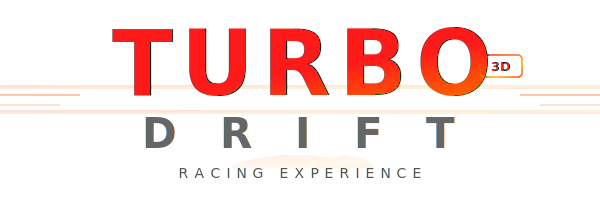

# 🏎️ TURBO DRIFT 3D

<p align="center">
  
</p>

<p align="center">
  <strong>A high-octane 3D racing experience built entirely in the browser</strong>
</p>

<p align="center">
  
  
  
  
</p>

---

## 🎮 About

**Turbo Drift 3D** is a feature-rich 3D racing game that runs entirely in your web browser — no downloads, no plugins, no installs. Built with **Three.js** for real-time 3D rendering and the **Web Audio API** for a rich, procedurally-generated soundtrack and sound effects.

Race through a neon-lit nighttime cityscape, drift around corners, complete missions, unlock achievements, and purchase new cars from the in-game shop. With four graphics presets from Low to Ultra, the game adapts to any hardware.

## ✨ Features

### 🏁 Core Racing
- **Realistic physics** — acceleration, braking, drift mechanics with handbrake, and nitro boost
- **Dynamic track** — procedurally generated circuit with barriers, kerbs, and checkered start/finish line
- **3 camera modes** — chase cam, hood cam, and top-down view
- **Full HUD** — speedometer, RPM bar, gear indicator, lap timer, minimap, nitro gauge, and drift score

### 🌃 Immersive World
- **Detailed 3D city** — skyscrapers with lit windows, telecom towers, construction cranes, water towers, gas stations, billboards, and hundreds of trees
- **Living atmosphere** — drifting clouds, blinking tower beacons, 5,000 stars, moonlit sky, volumetric fog
- **Full collision system** — every object in the world has proper collision detection with bounce physics and impact sparks

### 🎵 Audio System
- **3 procedural music tracks** — Synthwave, Dark Electronic, and Chill Ambient — all generated in real-time using the Web Audio API
- **Layered engine sound** — 4-oscillator engine with harmonic richness that responds to RPM and throttle
- **Dynamic SFX** — tire screeching, wind noise, metallic crash impacts, gear shifts, nitro whoosh, countdown beeps

### 🔐 Account System
- **User registration & login** — with persistent data storage across sessions
- **Guest mode** — play instantly without an account
- **Per-user progress** — stats, achievements, and shop purchases are saved per account

### 📋 Missions (10 objectives)
Track your progress across challenges like:
- Complete laps (1 / 5 / 20)
- Reach speed milestones (200 / 300 km/h)
- Accumulate drift points (500 / 5,000)
- Beat lap records (under 60s / 45s)
- Complete multiple races

### 🏆 Achievements (9 unlockables)
Earn achievements for milestones like your first race, reaching top speed, mastering drifts, and becoming a lap legend. Achievements pop up in real-time with animated notifications.

### 🛒 Car Shop
- **Earn coins** from completing missions and achievements
- **8 unique vehicles** — each with distinct 3D models, performance stats, and price tiers
- Purchased cars are saved to your account and available across sessions

### ⚙️ Graphics Settings
- **4 presets**: Low, Medium, High, Ultra
- Individual toggles for: Shadows, Particles, Camera Shake, Speed Lines, Bloom Effect
- Adjustable shadow resolution, pixel ratio, fog density, and particle count

### ℹ️ About Page
- Game credits and version info
- Donation link to support the developer

## 🚀 Getting Started

### Quick Start
```bash
# Clone the repository
git clone https://github.com/YOUR_USERNAME/turbo-drift-3d.git
cd turbo-drift-3d

# Start a local server (pick one):
python3 -m http.server 8000
# or
npx serve .
# or
php -S localhost:8000
```

Then open **http://localhost:8000** in your browser.

### Requirements
- A modern web browser (Chrome, Firefox, Edge, Safari)
- WebGL support (virtually all modern browsers)
- A local HTTP server (required for ES modules)

> **Note:** The game uses ES modules, so opening `index.html` directly from the filesystem (`file://`) won't work. You need to serve it via HTTP.

## 🎮 Controls

| Key | Action |
|-----|--------|
| `W` / `↑` | Accelerate |
| `S` / `↓` | Brake / Reverse |
| `A` / `←` | Steer Left |
| `D` / `→` | Steer Right |
| `SPACE` | Handbrake (Drift) |
| `SHIFT` | Nitro Boost |
| `C` | Cycle Camera Mode |
| `R` | Reset Position |
| `M` | Next Music Track |
| `ESC` | Pause Menu |

## 🏗️ Project Structure

```
turbo-drift-3d/
├── index.html          # Main game page
├── about.html          # About & credits page
├── css/
│   └── style.css       # All game styles
├── js/
│   ├── storage.js      # Persistent data layer
│   ├── auth.js         # Registration & login
│   ├── menu.js         # Menu navigation & settings
│   ├── shop.js         # Car shop system
│   ├── missions.js     # Mission definitions & tracking
│   ├── achievements.js # Achievement system
│   ├── audio.js        # SFX + procedural music engine
│   ├── cars.js         # Car data & 3D model builders
│   ├── world.js        # Track, city, environment generation
│   ├── physics.js      # Vehicle physics & collision
│   ├── hud.js          # HUD rendering
│   ├── particles.js    # Particle effects system
│   └── game.js         # Main orchestrator & render loop
├── assets/
│   └── logo.svg        # Game logo
└── README.md
```

## 🛠️ Tech Stack

- **[Three.js](https://threejs.org/)** r128 — 3D rendering engine
- **Web Audio API** — procedural music & sound effects
- **Vanilla JavaScript** (ES6 Modules) — zero build tools required
- **CSS3** — UI with animations, gradients, and blur effects
- **Persistent Storage API** — cross-session data persistence

## 📄 License

This project is licensed under the MIT License. Feel free to use, modify, and distribute.

---

<p align="center">
  Built with ❤️ and lots of <code>requestAnimationFrame</code>
</p>
